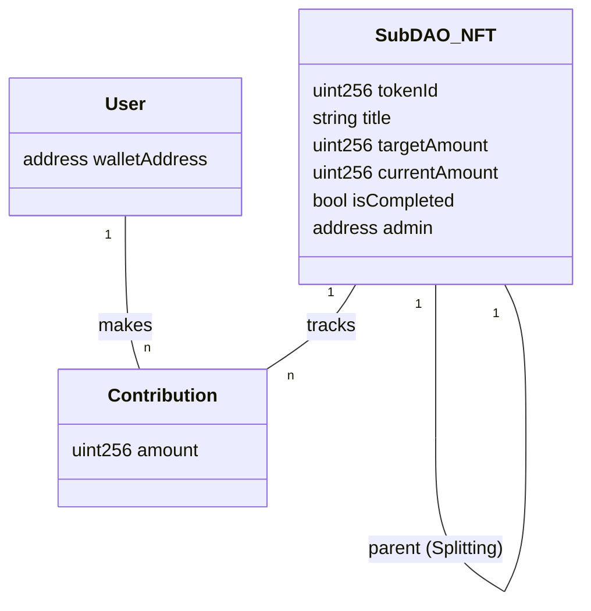

# 基本設計書：階層型 CO₂ 削減 DAO システム (MVP)

※この文書は AI にコーディングさせるために作成しています。基本設計書としてチーム内の合意を得ているものではありません。

## 1\. システム全体構成図 (Architecture)

本システムは、Ethereum ブロックチェーン（Sepolia Testnet）上にデプロイされた単一の ERC721 拡張コントラクトと、Next.js による DApp フロントエンドで構成されます。

### コンポーネント役割定義

| コンポーネント        | 技術スタック       | 役割                                                                         |
| :-------------------- | :----------------- | :--------------------------------------------------------------------------- |
| **Front-End**         | Next.js, Tailwind  | ユーザー UI。ウォレット接続、データの可視化、トランザクション発行を行う。    |
| **Blockchain Client** | ethers.js v6       | フロントエンドとスマートコントラクトの通信ブリッジ。                         |
| **Smart Contract**    | Solidity (Foundry) | ビジネスロジックの中核。NFT 管理、貢献データ記録、DAO 分割ロジックを担う。   |
| **File Storage**      | IPFS (Pinata 等)   | オフチェーンデータ（DAO の画像、詳細な説明文を含む JSON メタデータ）の保存。 |

---

## 2\. スマートコントラクト設計 (On-Chain)

MVP の効率性を考慮し、1 つのコントラクトで複数の SubDAO（Token ID）を管理する設計とします。

### 2.1 データ構造 (Structs & State Variables)

`SubDAO` 自体を ERC721 のトークンとして扱います。

**主要な構造体: `SubDAO`**

```solidity
struct SubDAO {
    string title;             // DAOのタイトル
    string description;       // 説明文
    uint256 targetAmount;     // 目標削減量 (単位: gram)
    uint256 currentAmount;    // 現在の削減量 (単位: gram)
    string uncompletedImageURI; // 未達成時の画像URI (IPFS)
    string completedImageURI;   // 達成時の画像URI (IPFS)
    bool isCompleted;         // 達成フラグ
    uint256 parentId;         // 親DAOのTokenID (0の場合はOrigin)
    address admin;            // 管理者（起案者）アドレス
}
```

**マッピング (Mappings)**

1.  `mapping(uint256 => SubDAO) public daos;`
    - Token ID から DAO 情報を取得。
2.  `mapping(uint256 => mapping(address => uint256)) public contributions;`
    - `[TokenID][UserAddress] => Amount` で個人の貢献量を記録。
3.  `mapping(uint256 => address[]) public daoMembers;`
    - DAO ごとの参加メンバーリスト（MVP における簡易的なメンバー管理）。

### 2.2 関数インターフェース (Functions)

#### A. DAO 作成 (Create/Mint)

- **関数名:** `createSubDAO`
- **引数:** `title`, `description`, `targetAmount`, `uncompletedURI`, `completedURI`
- **処理:**
  1.  `tokenId` をインクリメント。
  2.  `_mint(msg.sender, tokenId)` を実行（ERC721 発行）。
  3.  `SubDAO` 構造体を作成し、`daos[tokenId]` に保存。
  4.  `parentId` は `0` を設定。

#### B. 貢献記録 (Track Contribution)

- **関数名:** `contribute`
- **引数:** `tokenId`, `amount` (gram)
- **処理:**
  1.  `contributions[tokenId][msg.sender]` に `amount` を加算。
  2.  `daos[tokenId].currentAmount` に `amount` を加算。
  3.  **達成判定ロジック:**
      - $$currentAmount \ge targetAmount$$ かつ `!isCompleted` の場合：
        - `daos[tokenId].isCompleted = true`
        - Event `DAOCompleted(tokenId)` を発火。

#### C. DAO 分割 (Split DAO)

- **関数名:** `splitDAO`
- **引数:** `originalTokenId`
- **条件:** `msg.sender` が `originalTokenId` の管理者であること（またはメンバー数が閾値超え）。
- **処理:**
  1.  新しい `newTokenId` を生成。
  2.  親 DAO のメタデータ（Title, Target, URIs）をコピー。
  3.  **状態のリセット:** `currentAmount = 0`, `isCompleted = false`。
  4.  **系譜の記録:** `parentId = originalTokenId`。
  5.  `_mint` で管理者に対して新しい NFT を発行。

#### D. Dynamic NFT (URI Resolver)

- **関数名:** `tokenURI` (Override)
- **引数:** `tokenId`
- **処理:**
  - `daos[tokenId].isCompleted` を確認。
  - `true` なら `completedImageURI` を含む JSON を返す（または URI そのもの）。
  - `false` なら `uncompletedImageURI` を含む JSON を返す。

---

## 3\. フロントエンド設計 (Next.js)

### 3.1 画面遷移と主要コンポーネント

[Image of user interface flow chart]

#### 1\. Dashboard (Home)

- **表示要素:** SubDAO カードのグリッド表示。
- **ロジック:** コントラクトから `daos` をループで取得（または Graph Protocol 等の利用を検討するが、MVP では直接 Call で可）。
- **コンポーネント:** `<DAOCard />` (進捗バー付き)。

#### 2\. DAO Detail Page (`/dao/[id]`)

- **Dynamic NFT 表示:** `tokenURI` から取得した画像を表示。達成イベントを受け取ると、CSS アニメーション（紙吹雪等）を作動させる。
- **貢献フォーム:**
  - 数値入力 (`input type="number"`)。
  - 「記録する」ボタン → `contract.contribute(id, val)` を呼び出す。
- **分割ボタン:** 管理者アドレスのみに表示。「細胞分裂させる」ボタン → `contract.splitDAO(id)`。

#### 3\. Create DAO Page

- **画像アップロード:** ユーザーが画像を 2 枚（Before/After）選択 → Pinata API 経由で IPFS へアップロード → 返却された CID（URI）を用いてコントラクトの `createSubDAO` を叩く。

### 3.2 状態管理・データフェッチ

- **Wallet 接続:** `ethers.js` + `window.ethereum` (Metamask 等)。
- **数値処理:**
  - 入力: `kg` で入力させるが、送信時に `×1000` して `g` (整数) に変換。
  - 表示: コントラクトから取得した `g` を `/1000` して `kg` 表示。

---

## 4\. データモデル・ER 図イメージ (Conceptual)

MVP では RDB を使用しませんが、概念的なデータの関連性は以下の通りです。


